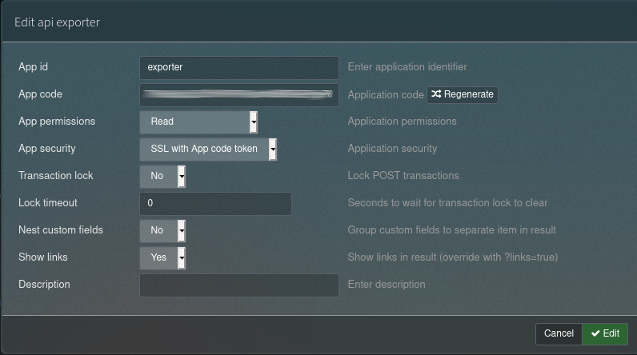

================
phpipam-exporter
================

The generator DHCP, DNS or hosts records from `phpipam <https://phpipam.net/>`_.

Usage
============

All parameters can be defined as environment variables.

.. list-table:: **Program parameters**
    :header-rows: 1

    * - Parameter
      - ENV variable
      - Required
      - Description
    * - ``--subnet / -s``
      - ``PHPIPAM_SUBNETS``
      - Yes
      - Filter output for specific PHPIPAM subnet. Can be used more times (in ``PHPIPAM_SUBNETS``, subnets are separated by coma).
    * - ``--host``
      - ``PHPIPAM_HOST``
      - Yes
      - phpipam API entrypoint format ``https://<fqdn>/api/<api_id>/`` (e.g. ``https://phpipam.example.com/api/exporter/``)
    * - ``--token``
      - ``PHPIPAM_TOKEN``
      - Yes
      - phpipam API token.
    * - ``--format / -f``
      - ``PHPIPAM_FORMAT``
      - No (default: ``json``)
      - Output format. (``dhcpd``, ``dnsmasq``, ``hosts``)
    * - ``--output / -o``
      - ``PHPIPAM_OUTPUT``
      - No (default: ``stdout``)
      - Output file.
    * - ``--on-change-action``
      - ``PHPIPAM_ON_CHANGE_ACTION``
      - No
      - Bash command. This command is fired only when the output file is changed. This parameter has to be defined only together with ``--output``. (e.g. ``systemctl reload named``)
    * - ``--custom-template``
      - ``PHPIPAM_CUSTOM_TEMPLATE``
      - No
      - Path to custom `Jinja <https://jinja2docs.readthedocs.io/en/stable/>`_ template file.

Generate API token
======================

Enable API plugin:  ``Administration > phpIPAM settings > API = On``

Create token: ``Administration > API > Create API key``

.. list-table:: **Token parameters**
    :header-rows: 0

    * - ``App ID``
      - ``exporter``
    * - ``App permissions``
      - ``Read``
    * - ``App security``
      - ``SSL with App code token``

Copy ``App code`` and use it as ``PHPIPAM_TOKEN``.
``App ID`` has to be used as part of ``PHPIPAM_HOST``.

Hosts file
============
.. code-block:: bash

    export PHPIPAM_TOKEN='12345678945678912345678a1235'
    export PHPIPAM_HOST='https://phpipam.example.com/api/exporter/'

    cat /etc/hosts.static
      127.0.0.1   localhost localhost.localdomain
      ::1         localhost localhost.localdomain

    phpipam_export -s 192.168.1.0/24 -f dhcpd -o /etc/hosts.dynamic --on-change-action "cat /etc/hosts.static /etc/hosts.dynamic >> /etc/hosts"

DHCPd
============
.. code-block:: bash

    export PHPIPAM_TOKEN='12345678945678912345678a1235'
    export PHPIPAM_HOST='https://phpipam.example.com/api/exporter/'

    phpipam_export -s 192.168.1.0/24 -f dhcpd -o /etc/dhcp/subnet.conf --on-change-action "systemctl reload dhcpd"

**/etc/dhcp/dhcpd.conf**

.. code-block::

    authoritative;
    ddns-update-style none;
    default-lease-time 86400;
    max-lease-time 172800;
    shared-network "lan" {
        subnet 192.168.1.0 netmask 255.255.255.0 {
            option subnet-mask 255.255.255.0;
            option domain-name-servers 192.168.1.1, 192.168.1.2;
            option broadcast-address 192.168.1.255;
            option routers 192.168.1.1;
            pool {
                range 192.168.1.254 192.168.1.254;
                deny unknown-clients;
                include "/etc/dhcp/subnet.conf";
            }
        }

dnsmasq
============
.. code-block:: bash

    export PHPIPAM_TOKEN='12345678945678912345678a1235'
    export PHPIPAM_HOST='https://phpipam.example.com/api/exporter/'

    phpipam_export -s 192.168.1.0/24 -f dnsmasq -o /etc/dnsmasq.d/subnet.conf --on-change-action "systemctl reload dnsmasq"

json format
============
.. code-block:: bash

    export PHPIPAM_TOKEN='12345678945678912345678a1235'
    export PHPIPAM_HOST='https://phpipam.example.com/api/exporter/'

    phpipam_export -s 192.168.1.0/24 -f json

Custom template
=======================
We can create a custom `Jinja <https://jinja2docs.readthedocs.io/en/stable/>`_ template file and use it for formating output data. The addresses are stored in the ``addresses`` template variable. Attributes of each device are described here `3.4 Addresses controller <https://phpipam.net/api-documentation/>`_ or we can use ``json`` format to get all attributes.

.. code-block:: bash

    export PHPIPAM_TOKEN='12345678945678912345678a1235'
    export PHPIPAM_HOST='https://phpipam.example.com/api/exporter/'

    phpipam_export -s 192.168.1.0/24 --custom-template ansible_inventory.j2  -o /ansible-project/inventory.yml
